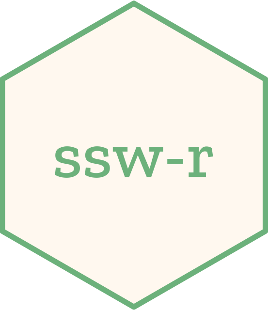

# ssw-r 

<!-- badges: start -->
[](https://github.com/nanxstats/ssw-r/actions/workflows/R-CMD-check.yaml)

<!-- badges: end -->

ssw-r offers an R interface for
[SSW](https://github.com/mengyao/Complete-Striped-Smith-Waterman-Library),
a fast implementation of the Smith-Waterman algorithm for sequence alignment
using SIMD. ssw-r is currently built on the Python package
[ssw-py](https://pypi.org/project/ssw-py/).

## Installation

You can install ssw-r from CRAN once available:

```r
install.packages("ssw")
```

Or try the development version on GitHub:

```r
remotes::install_github("nanxstats/ssw-r")
```

## Install ssw-py

A simple way to install the Python package ssw-py that ssw-r can discover
easily, is to run the helper function `ssw::install_ssw_py()`.
By default, it installs ssw-py into an virtual environment named `r-ssw-py`.

```r
ssw::install_ssw_py()
```

This follows the best practices suggested by the reticulate vignette
[Managing an R Package's Python
Dependencies](https://rstudio.github.io/reticulate/articles/python_dependencies.html).
There are also recommendations in the vignette on how to manage multiple
R packages with different Python dependencies.

## Usage

```r
library("ssw")
```

```r
"ACGT" |> align("TTTTACGTCCCCC")
```

```text
CIGAR start index 4: 4M
optimal_score: 8
sub-optimal_score: 0
target_begin: 4	target_end: 7
query_begin: 0
query_end: 3

Target:        4    ACGT    7
                    ||||
Query:         0    ACGT    3
```

```r
"ACGT" |> align("TTTTACTCCCCC", gap_open = 3)
```

```text
CIGAR start index 4: 2M
optimal_score: 4
sub-optimal_score: 0
target_begin: 4	target_end: 5
query_begin: 0
query_end: 1

Target:        4    AC    5
                    ||
Query:         0    AC    1
```

```r
"ACTG" |> force_align("TTTTCTGCCCCCACG") |> formatter(print = TRUE)
```

```text
TTTTCTGCCCCCACG
   ACTG
```

For detailed usage, see the [vignette](https://nanx.me/ssw-r/articles/ssw.html).

## Acknowledgements

ssw-r is built upon the work of two outstanding projects:

1. [SSW](https://github.com/mengyao/Complete-Striped-Smith-Waterman-Library) - Original C implementation. Author: Mengyao Zhao
1. [ssw-py](https://pypi.org/project/ssw-py/) - Python binding for SSW. Author: Nick Conway

We extend our sincere gratitude to Mengyao Zhao for developing the original
SSW library and to Nick Conway for maintaining the ssw-py package.
Their work forms the foundation of ssw-r.
While ssw-r does not directly incorporate code from these projects,
it serves as an R interface to their functionality. We encourage users to
visit the original repositories for more information about the underlying
implementation and to consider citing these works in publications that use ssw-r.

## License

This project is licensed under the MIT license.
